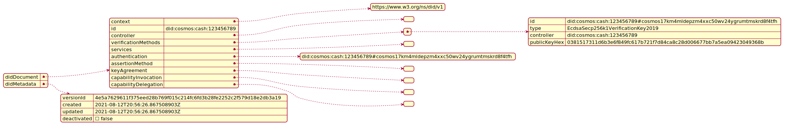
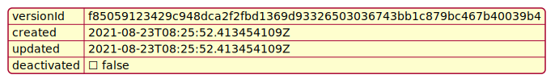

# State

This document describes the state pertaining to:

1. [DidDocument](./02_state.md#identifier)
2. [DidMetadata](./02_state.md#didmetadata)

The data structures representing a DID document according to the [W3C DID recommendation](https://www.w3.org/TR/did-core/) are shown in the following diagram:

The data structure for a [DID metadata](https://www.w3.org/TR/did-core/#did-document-metadata) are represented in the following diagram:

## DidDocument
DidDocuments are stored in the state under the `0x61` key and are stored using their ids

- DidDocument: `0x61 | DidDocument.Id -> ProtocolBuffer(DidDocument)`

A did document has the following fields:

- `id` - a string containing the did of the document (required).
- `context` - a list of string containing the [json ld contexts](https://json-ld.org/spec/latest/json-ld/#the-context) used in the did document
- `controller` - a list of did string for the did document
- `verificationMethod` - a list of [Verification Method](02_state.md#verification_method) objects. The `id` field of each verification method must be unique within a did document
- `service` - a list of [Service](02_state.md#service) objects. The `id` field of each service must be unique within a did document.

in addition, the following fields map the verification relationships defined in the [W3C DID recommendations](), they are all list of strings that should match one of the verification method id contained in the `verificationMethod` field of the did document:

- `authentication`
- `assertionMethod`
- `keyAgreement`
- `capabilityInvocation`
- `capabilityDelegation`

#### Source 
+++ https://github.com/allinbits/cosmos-cash/blob/v1.0.0/proto/did/did.proto#L15

### Verification Method

Verification methods are stored within a DidDocument and are used to store public key information as described in the [W3C DID recommendations](https://w3c.github.io/did-core/#verification-methods).

A verification method has the following fields:

- `id` - a string containing the unique identifier of the verification method (required).
- `type` - a string the type of verification method 
- `controller` - a string containing the did of the owner of the key 
- `verificationMaterial`: a string that is either   
  - `blockchainAccountID` - a string representing a cosmos based account address
  - `publicKeyHex` - a string representing a public key encoded as a hex string
  - `publicKeyMultibase` - a string representing a public key encoded according to the Multibase Data Format [Hexadecimal upper-case encoding](https://datatracker.ietf.org/doc/html/draft-multiformats-multibase#appendix-B.1)
  
#### Source 
+++ https://github.com/allinbits/cosmos-cash/blob/v1.0.0/proto/did/did.proto#L73

### Service
A Service is stored as a slice within a DidDocument data structure. Services are used to describe communication interfaces for a DID as described in the [W3C DID recommendations](https://w3c.github.io/did-core/#services)

A service has the following fields:

- `id` - a string representing the service id
- `type` - a string representing the type of the service (for example: DIDComm)
- `serviceEndpoint` - a string representing the endpoint of the service, such as an URL

#### Source 

+++ https://github.com/allinbits/cosmos-cash/blob/v1.0.0/proto/did/did.proto#L87

## DidMetadata

A DidMetadata stores information relative to a DID document. The implementation supports the following fields: 

- versionId - the version of the last update operation for the did document
- updated - the timestamp of the last update operation for the did document 
- created - the timestamp of the create operation.
- deactivated - a boolean indicating if the did has been deactivated
#### Source 
+++ https://github.com/allinbits/cosmos-cash/blob/v1.0.0/proto/did/did.proto#L98

